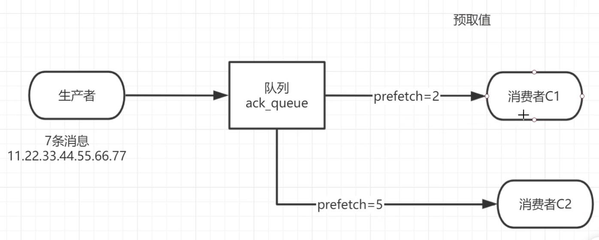

## 消费者接收消息的过程


#### 1、接收消息过程

当一个消息队列上有2个或2个以上的消费者，消息的分发模式：

- 默认情况下消息是通过轮询消费者的方式到达具体的消费者的。确保一条消息只能被消费一次，不能消费多次！

- 不公平分发，不同的消费者性能不同消费的吞吐量也不同，所以不能光靠轮询去分发，那么就需要配置消费者消费的时候模式为不公平分发，只需要将消费者信道的一个参数配置为1即可

  ```java
  channel.basicQos(1);
  ```

- 预取值分发，不再看消费者的性能，而是规定在一定的消费总数下，该消费者一定会得到多少条消息

  

  上图，总共有7条消息，消费者C1肯定会得到2条消息，消费者C2肯定会得到5条消息

  具体的配置跟不公平分发是1个参数，只是不能配置为1了

  ```java
  channel.basicQos(5);
  ```

  


#### 2、应答机制

当在项目中开启了消费者自动应答，那么会有很严重的问题，当消费者一旦跟queue建立连接，queue随即会把所有的消息一次性发送到消费者，不管消费者有没有对具体的消息进行消费，服务端只要成功把消息发送给了消费者都会默认对消息进行ack处理并删除消息，那么如果在处理过程中消费者宕机会导致消息的丢失！如果消费者开启了手动应答则需要消费一条消息之后消费者主动告诉服务端本条消息被消费了可以删除了，服务端才会把这条消息删除掉！如果开启了手动应答，消费者具体需要如何处理呢？

- 肯定确认，消费者告知服务端消息已经被消费，可以删除消息

  channel.basicAck(DeliveryTag, 是否批量应答true/false)

- 否定确认，消费者告诉服务端消息消费出现问题，需要将消息重新放回队列

  channel.basicNack(DeliveryTag, 是否批量应答true/false, 是否将消息重新放回队列true/false)

- 否定确认，消费者告诉服务端消费者拒绝消费这条消息，服务端可以将消息删除

  channle.basicReject(DeliveryTag, 是否批量应答true/false, )

​	

​	什么是批量应答？<font color="red">建议关闭批量应答</font>

​	批量应答如果打开，那么channel上的tag为5,6,7,8这4条消息，当前消息是8，进行了批量应答，那么此时5-8这些还未应答的消息都会一次性被应答给服务端。

​	批量应答如果关闭，就切换成了逐个应答，那么channel上的tag为5,6,7,8这4条消息，当前消息是8，那么只会对8的这条消息进行应答给服务器。

