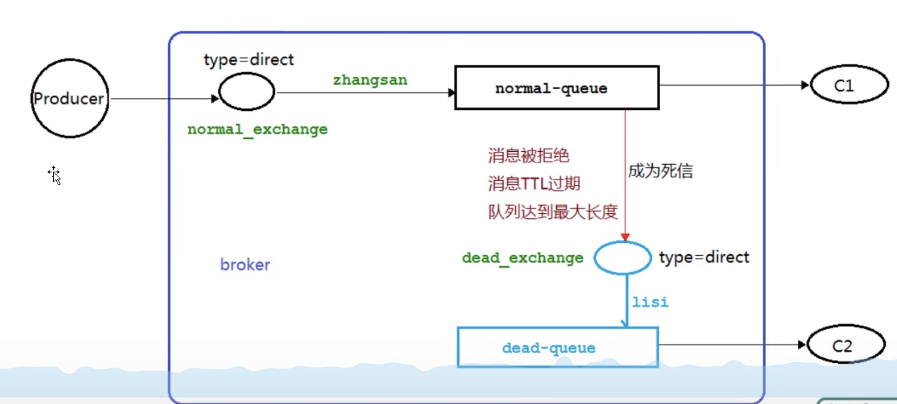

## 死信队列概念

死信队列就是一个普通的队列，不过队列中存放的是死信。所谓的死信就是该消息不会再有任何人来消费它，成为死信，死信产生有三种途径 1、其它队列中的消息被消费者拒绝消费的（手动使用.basicNack或者.basicReject的消息）2、其它队列中消息的TTL过期的 3、队列达到最大长度后续放到队列中的数据 都可以成为死信，

大致架构如下：

当normal-queue中的消息触发了死信产生的3个条件，就会把消息转发到dead_exchange这个交换机中，随后进入到dead-queue这个队列中。