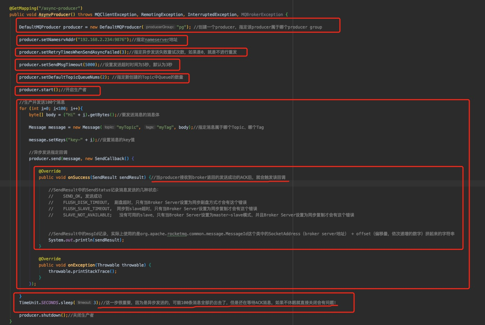
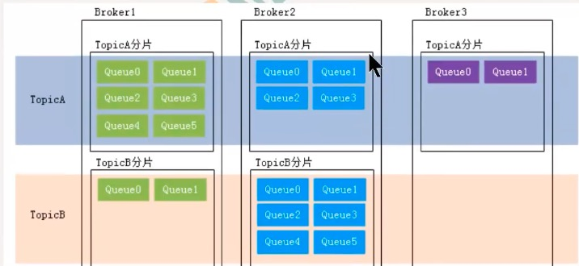

## RocketMQ中的一些基础概念

#### 1、生产者（Producer）与生产者组（Producer Group）

消息生产者，负责生产消息。Producer通过RocketMQ的负载均衡模块（name server）选择相应的Broker集群中的Broker，向队列（Queue）进行消息投递，投递的过程支持快速失败并且低延迟。

消息生产者都是以生产者组（Producer group）的形式出现的。一个生产者组中的不同的生产者可以发送不同主题的消息。

#### 2、消费者（Consumer）与消费者组（Consumer Group）

消费者都是以消费者组的形式出现的。消费者组是同一类消费者的集合，这类Consumer消费的是同一个Topic类型的消息。消费者组使得在消息消费方面，实现负载均衡（对Queue的负载均衡，根据Queue的数量把Queue平均分配给同一个Consumer Group中的不同的Consumer）和容错（消费者中，一个消费者中途挂掉了，该Consumer Group中的其它的Consumer可以接着消费原Consumer消费的Queue）的目标变得非常容易。

注意点：

1. **同一个消费者组中的所有消费者，其消费的消息的Topic和tag必须一致！！！**

   

   如果，订阅关系不一致，会造成消息丢失的问题！原因在于：如果订阅不一致，同一个消费者组的消费者后启动的会覆盖掉broker中保存的消费者组订阅关系。

   举例：消费组 1 消费 Topic1 中的消息时，Consumer1 通过 ConsumeQueue1 和 ConsumeQueue2 进行消费，Consumer2 通过 ConsumeQueue3 和 ConsumeQueue4 进行消费，如果 Consumer1 订阅了 Tag1，   Consumer2 订阅了 Tag2，那 Consumer1 从 ConsumeQueue1 和 ConsumeQueue2 消费消息时，就会把 Tag2 中的消息过滤掉，这样即使 Consumer2 订阅了 Tag2，也不能消费到 ConsumeQueue1 和 ConsumeQueue2 里 Tag2 中的消息了。

2. **一个消费者组可以订阅多个Topic，但是订阅的时候，确保订阅的Topic和tag一致，且tag顺序也要一致！**

3. 消费者组中Consumer的数量应该小于等于订阅Topic的Queue数量。如果超过Queue的数量。则多出的Consumer将不能消费消息。

#### 3、消息（Message）

生产者和消费者处理数据的最小单位，每条消息必须属于一个主题。因为，主题下才有队列，只有在消息中提供了主题，才知道消息往哪些队列投递！

#### 4、主题（Topic）

一类消息的集合，每个主题包含若干条消息，每条消息只能属于一个主题，是RocketMQ进行消息订阅的基本单位。

一个生产者可以同时发送多种Topic的消息；一个消费者只可以订阅和消费一种Topic的消息；一个Topic可以被一个或多个消费者组消费。

Tpoic下有用于存储消息的队列。

#### 5、队列（Queue）

一个Topic中可以包含多个Queue，每个Queue中存放的就是该Topic的消息。一个Topic的Queue也被称为一个Topic的消息分区。

**一个Queue，只能被同一个消费者组中的一个消费者消费，不同的消费者组可以不是同一个消费者。**

#### 6、标签(Tag)

为消息设置标签，用于同一主题下区分不同类型的消息。来自同一业务单元的消息，可以根据不同业务目的在同一主题下设置不同标签。消费者可以根据Tag实现对不同子主题的不同消费逻辑，实现更好的扩展性。

**同一个消费者组中的消费者，其消费的消息的Topic和tag必须一致！！！**

#### 7、消息标识（MessageId/Key）

RocketMQ中每个消息拥有MessageId, 且在发送的时候可以携带具有业务标识的Key，以方便对消息的查询。不过需要注意的是，MessageId有两个: 在生产者send()消息时会自动生成一个MessageId (msgId), 当消息到达Broker后，Broker也会自动生成一 个Messageld(offsetMsgId)。 msgId、 offsetMsgId与key都称为消息标识。

- msgId：由producer端生成，其生成规则为， producerIp +进程pid + MessageClientIDSetter类的ClassLoader的hashcode +当前时间+ AutomicInteger自增计数器
- offsetMsgId：由broker端生成，其生成规则为: brokerIp +物理分区的offset（就是Queue的偏移量）
- key： 由生产者在发送消息的时候指定的业务相关的唯一标识

#### 8、Topic分片（Sharding）

> 这个东西 看看就行了 

在Broker集群下，一个Topic会被切割到Broker集群中，被切分的的Topic，就会形成Topic分片

