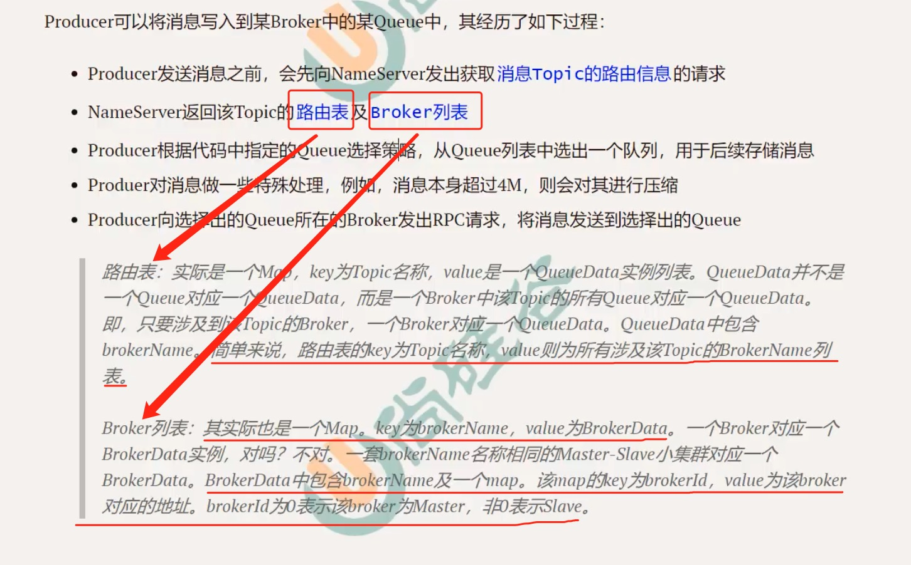
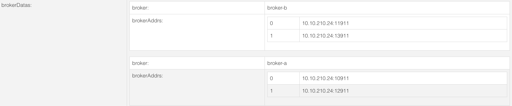

## Name Server的基础概念

#### Name Server是什么

NameServer类似于我们使用的Nacos，在RocketMQ中充当注册中心和配置中心的作用！

- 注册中心的概念

  Broker集群中的所有的Broker会向Name Server进行注册，每个Broker都需要向Name Server提供心跳检测，向Name Server报告Broker是否还存活！

- 配置中心的概念

  Broker注册到Name Server后，Broker中的存储的每个Topic的路由表和Broker列表都会被Name Server获取并保存。Poducer和Consumer通过Name Server可以获取整个Broker集群的路由信息，从而进行消息的投递和消费。

  

  路由表和Broker列表大概长如下的样子

  

  

