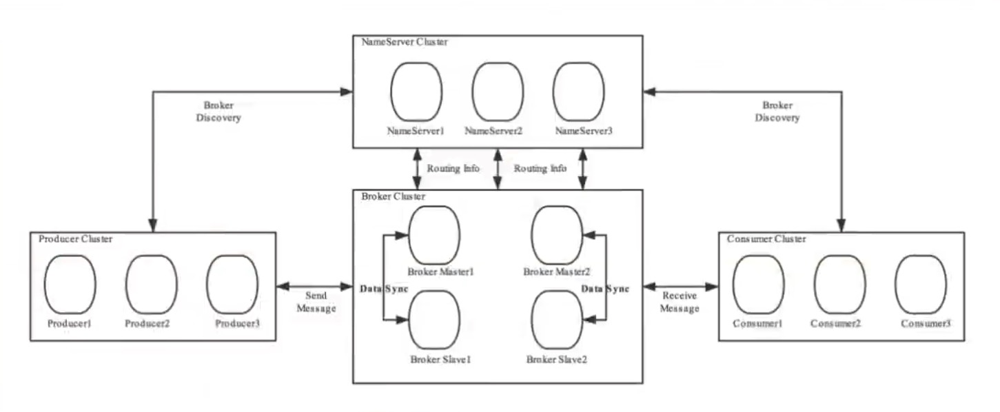
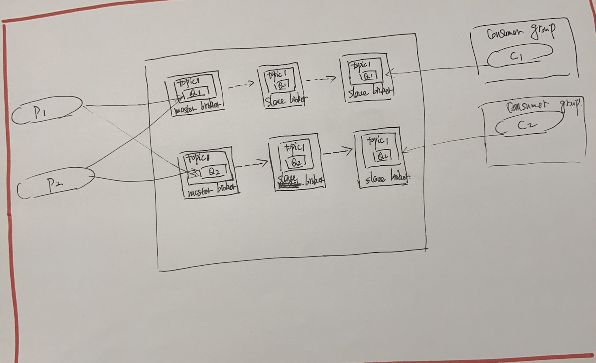

## Broker Server的基础概念

#### Broker Server的作用

Broker Server充当着消息中转角色，负责存储消息、转发消息。

Broke Serverr在RocketMQ系统中负责接收并存储从生产者发送来的消息，同时为消费者的拉取请求作准备。Broker同时也存储着消息相关的元数据，包括消费者组消费进度偏移offset、主题、队列等。

#### Broker  Server的内部组成

Remoting Module: 整个Broker的实体，而这个Broker实体则由以下模块构成。

- Client Manager: 客户端管理器。负责接收、解析客户端(Producer/Consumer)请求， 管理客户端。例如，维护Consumer的Topic订阅信息。
- Store Service: 存储服务。提供方便简单的API接口，处理消息存储到物理硬盘和消息查询功能。
- HA Service: 高可用服务，提供Master Broker和Slave Broker之间的数据同步功能。
- Index Service: 索引服务。根据特定的消息的 key,对投递到Broker的消息进行索引服务，同时也提供根据消息 Key对消息进行快速查询的功能。

#### Broker Server的集群架构

为了增强Broker Server性能与吞吐量，Broker Server一般都是以集群形式出现的。各集群节点中可能存放着相同Topic的不同Queue。不过，这里有个问题，如果某Broker节点宕机，如何保证数据不丢失呢?其解决方案是，将每个Broker集群节点进行横向扩展，即在每个Broker Server节点后将一个从 Broker Server节点，形成一个组从结构，解决单点问题。

Broker Server节点集群是一个主备集群，即集群中具有Master与Slave两种角色。Master负责处理读写操作请求，Slave负责对Master中的数据进行备份。当Master挂掉了 ，Slave则会自动切换为Master去工作。所以这个Broke Serverr集群是主备集群。一个Master可以包含多个Slave, 但一个Slave只能隶属于一个Master。Master与Slave的对应关系是通过指定相同的BrokerName、不同的BrokerId 来确定的。BrokerId为0表示Master,非0表示Slave。每个Broker与NameServer集群中的所有节点建立长连接，定时注册Topic信息到所有Name Server。

大致如下图

