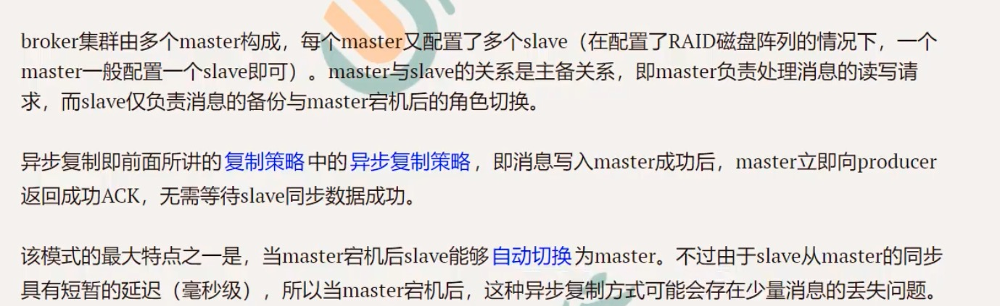

## Broker Server的集群方式

#### 仅多master集群

broker集群仅由多个master构成，不存在slave，同一Topic的各个Queue会平均分布在各个master节点上。

优点：配置简单，单个Master宕机或重启维护对应用无影响，在磁盘配置为RAID10时，即使机器宕机不可恢复的情况下，由于RAID10磁盘非常可靠，消息也不会丢（异步刷盘丢失少量消息，同步刷盘一条不丢），性能最高

缺点：一个Broker Server宕机期间，这台机器上未被消费的消息在机器恢复之前不可消费，消息实时性会受到影响。

#### 多master多slave ---异步复制异步刷盘

#### 多master多slave ---同步双写

最佳实践：多master多slave（1个slave）异步复制 + raid10磁盘阵列