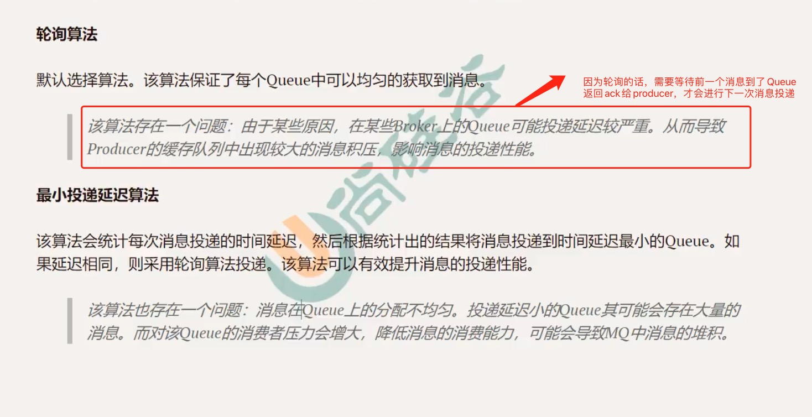

## Producer发送消息如何选择Broker Server和Queue

#### 1、Producer如何选择Broker Server

通过[这儿](../入门/4、Name Server集群中如何选择哪个Name Server向客户端（Producer或Consumer）提供服务？.md)我们已经知道了，如何选择NameServer，确定了Name Server后就会经历如下过程选择Broker Server：

路由表和Broker列表大概长如下的样子

然后Producer会跟指定Tpoic下所有的Broker Server建立长连接。

#### 2、Producer如何选择Queue

确定了Broker Server后，Producer需要确定，要投递的消息放到哪个Queue中，针对不同的消息类型，Queue的选择策略是不一样的

- 无序消息的Queue的选择策略

  

- 有序消息的选择策略

  只会往固定一个Queue上传递！
