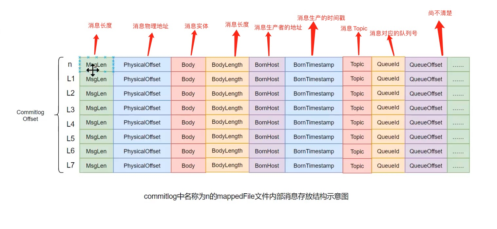
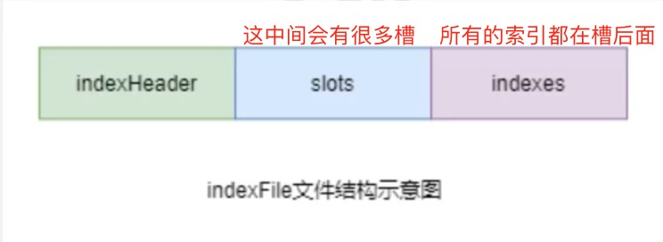
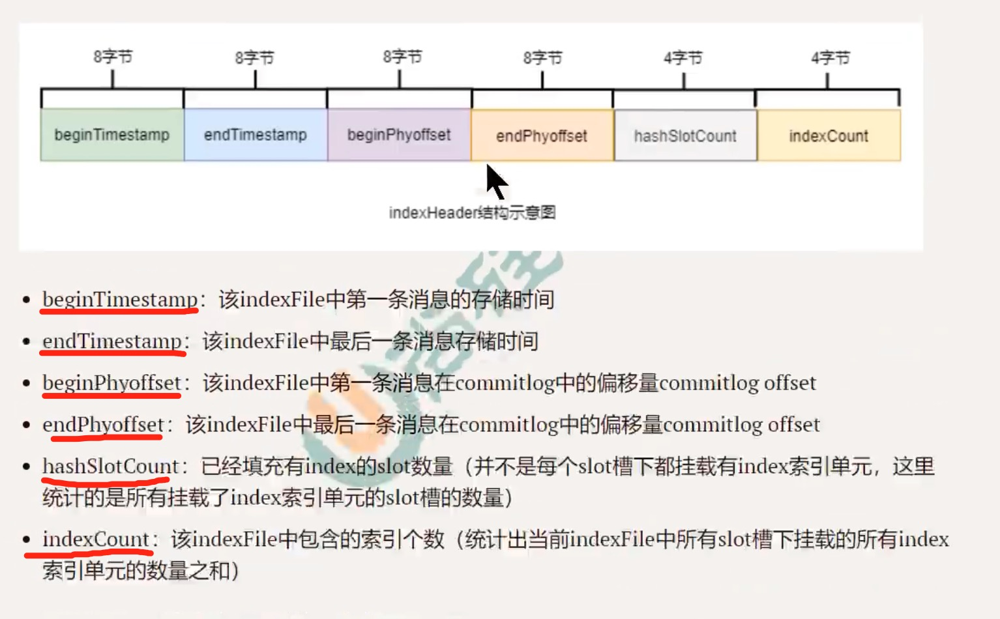
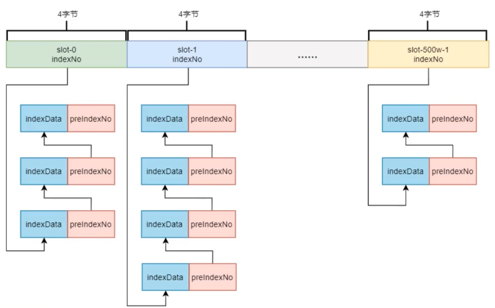
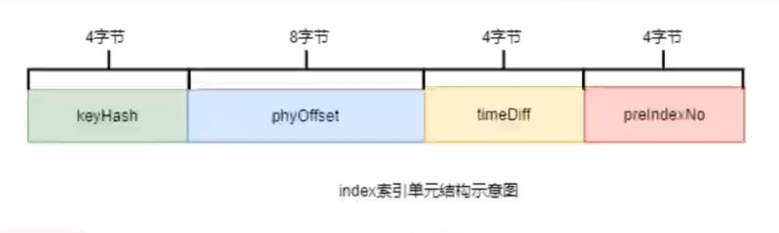

## Message带key到达了Broker Server后是如何被存储的

带key的Message是为了，让我们快速查询到消息！

#### Message带key是什么意思

在创建Message的时候，可以设置Message的key，而我们所讲的情况是设置key的！

#### Message在Broker Server被存储的过程概述

1. Broker根据消息所属的Topic、queueId（queueId在客户端发送数据的时候已经确定了）,获取到即将被写入消息对应索引条目在consumequeue目录中的写入偏移量（就是在000000000000000000000这个文件中获取即将被写入消息的偏移量），即QueueOffset。

   

   每个Queue中的文件（00000000000000000000），文件名都是固定的（因为它也是记录第一条数据的偏移量，但是，它的每一条数据都是固定的长度，所以名称是固定的。）

2. 将queueId、queueOffset等数据， 与消息一起封装为消息单元

3. 将消息单元写入到commitlog

   

   在Broker Server的store目录中就有一个commitlog目录，commitlog目录中有很多文件，这些文件被称为mappedFile文件。Message最终都会被记录到这些mappedFile文件中。

   mappedFile文件大小为1G (小于等于1G)，文件名由20位十进制（多少字节的数据）数构成，表示当前文件的第一条消息的起始位移偏移量。

   > 第一个文件名一定是20位0构成的。因为第一个文件的第一条消息的偏移量commitlog offset为0。当第一个文件放满时，则会自动生成第二个文件继续存放消息。假设第一个文件大小是1073741820字节(1G= 1073741824字节)，则第二个文件名就是0000000001073741824。以此类推，第n个文件名应该是前n-1 个文件大小之和。一个Broker Server中所有mappedFile文件的commitlog offet是连续的。
   >
   > 
   >
   > 无论当前Broker Server中存放着多少Topic的消息，这些消息都是被顺序写入到了mappedFile文件中的。也就是说，这些**消息在Commitlog中存放时并没有被按照Topic进行分类存放**。
   >
   > 
   >
   > commitlog文件中每一条消息的具体组成：
   >
   > 

4. 形成消息索引条目

   消息索引条目长这样,所有的消息产生的消息索引条目，长度都是一致的！

   

5. 将消息索引条目分发到相应的consumequeue中对应的Topic的QueueId的文件（即0000000000000000000）中

   

   每个Queue中的文件，文件中可以包含30万条数据。

   

6. 因为是带key的消息，需要把Messag在commitlog Offset，封装成index数据，保存到store/index的indexFile中。

   每个Broker Server中会包含多个indexFile文件，每个indexFile都是以一个时间戳(这个indexFile创建时的时间戳)命名的，每个indexFile文件由三部分组成：indexHeader、slots槽位、indexes索引数据。每个indexFile中包含500万个slots槽位。而每个slots槽又可能挂载很多的index索引单元。每个indexFile中包含2000万个index。

   

   - indexHeader固定40个字节，存放数据如下：

     

     

   - slots槽

     要想了解slots槽，离不开indexes。

     key的hash值 % 5000000 的结果即为slot槽位，然后将该slot值修改为该index索引单元的indexNo(indexNo是自增的，往indexFile文件末尾添加就行),根据这个indexNo可以计算出该index单元在indexFile中的位置。不过，该取模结果的重复率是很高的（都会放在一个slot槽中，而槽中只会记录一个index的记录（indexNo）），为了解决该问题，在每个index索引单元中增加了preIndexNo,用于指定该slot中当前index索引单元的前一一个index索引单元。而slot中始终存放的是其下最新的index索引单元的indexNo,这样的话，只要找到了slot就可以找到其最新的index索引单元，而通过这个index索引单元就可以找到其之前的所有index索引元。

     

     

   - indexes用于存放将Message写入到commitlog后，得到的commitlog offset，封装成的index数据的地方

     每个index数据长如下的样子

     

     keyHash: 消息中指定的业务key的hash值

     phyOffset: 当前key对应的消息在commitlog中的偏移量commitlog offset

     timeDiff: 当前key对应消息的存储时间与当前indexFile创建时间的时间差

     preIndexNo: 当前slot下当前index索引单元的前一个index索引单元的indexNo

     