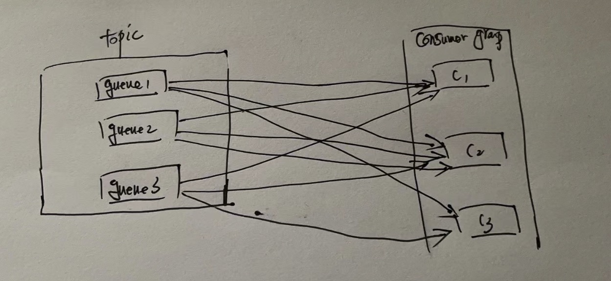
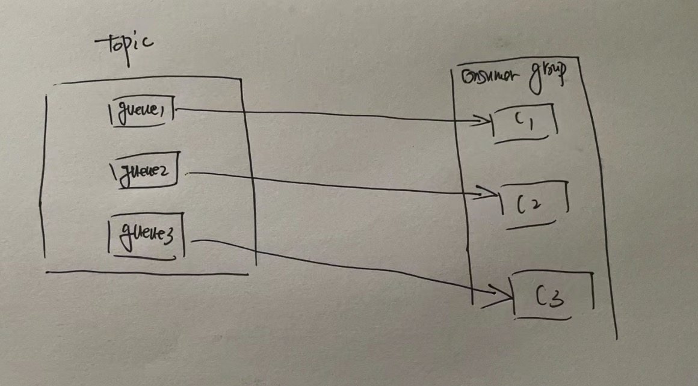

## Consumer消费消息的时候分为广播模式和集群模式

消费者默认使用集群模式！


广播消费指的是：

一条消息被多个consumer消费，即使这些consumer属于同一个ConsumerGroup,消息也会被ConsumerGroup中的每个Consumer都消费一次，广播消费中ConsumerGroup概念可以认为在消息划分方面无意义。



 

集群消费模式：

一个ConsumerGroup中的Consumer实例平均分摊消费消息。例如某个Topic有9条消息，其中一个ConsumerGroup有3个实例（可能是3个进程，或者3台机器），那么每个实例只消费某几个队列上的数据，消费完的消息不能被其他实例消费。




使用代码实现进行测试：

准备生产者代码

```java
@GetMapping("/index")
    public void index() throws MQClientException, RemotingException, InterruptedException {
      DefaultMQProducer producer = new DefaultMQProducer("pg");
      producer.setNamesrvAddr("10.10.210.24:9876;10.10.210.24:9877");
      producer.setRetryTimesWhenSendAsyncFailed(3);
      producer.setSendMsgTimeout(5000);
      producer.start();


      byte[] body = ("keyxxxx").getBytes();

      Message message = new Message("t4", "mtYag", body);


      producer.send(message, new SendCallback() {
        @Override
        public void onSuccess(SendResult sendResult) {
          System.out.println(sendResult);
        }

        @Override
        public void onException(Throwable throwable) {
          throwable.printStackTrace();
        }
      });

      //        TimeUnit.SECONDS.sleep(3);
      //
      //        producer.shutdown();
    }
```


准备广播模式下消费者代码

```java
@GetMapping("/index2")
    public void index2() throws MQClientException {

        DefaultLitePullConsumer consumer = new DefaultLitePullConsumer("cpg");
        consumer.setNamesrvAddr("10.10.210.24:9876;10.10.210.24:9877");
        consumer.subscribe("t4", "*");//订阅消费的Topic和tag
        consumer.setPullBatchSize(50); //设置一次拉取最多多少条消息，实际拉取可能不到这个数值
        consumer.setPollTimeoutMillis(5000); //拉取超时时间
        consumer.setMessageModel(MessageModel.BROADCASTING); //设置为广播模式
        consumer.start();

        while(true){
            try {
                List<MessageExt> msgs = consumer.poll(5000); //执行一次拉取，超时设置为5秒
                if (CollectionUtils.isEmpty(msgs)){
                    System.out.println("没有拉取到消息，休息10S");
                }else{
                    msgs.forEach((msg)->{ //打印拉取到的消息
                        System.out.println(msg);
                    });
                    consumer.commitSync(); //消息消费完成，一定要告诉Broker Server消息已经被消费了，然后Broker server会同步队列的消费位置！
                }
            }catch (Exception e){
                consumer.shutdown();
                e.printStackTrace();
            }
        }

    }
```

consumer.setMessageModel(MessageModel.BROADCASTING); 就是这是的广播模式


准备集群模式下的消费者代码

```java
@GetMapping("/index2")
    public void index2() throws MQClientException {

        DefaultLitePullConsumer consumer = new DefaultLitePullConsumer("cpg");
        consumer.setNamesrvAddr("10.10.210.24:9876;10.10.210.24:9877");
        consumer.subscribe("t4", "*");//订阅消费的Topic和tag
        consumer.setPullBatchSize(50); //设置一次拉取最多多少条消息，实际拉取可能不到这个数值
        consumer.setPollTimeoutMillis(5000); //拉取超时时间
        consumer.setMessageModel(MessageModel.CLUSTERING); //设置为集群模式
        consumer.start();

        while(true){
            try {
                List<MessageExt> msgs = consumer.poll(5000); //执行一次拉取，超时设置为5秒
                if (CollectionUtils.isEmpty(msgs)){
                    System.out.println("没有拉取到消息，休息10S");
                }else{
                    msgs.forEach((msg)->{ //打印拉取到的消息
                        System.out.println(msg);
                    });
                    consumer.commitSync(); //消息消费完成，一定要告诉Broker Server消息已经被消费了，然后Broker server会同步队列的消费位置！
                }
            }catch (Exception e){
                consumer.shutdown();
                e.printStackTrace();
            }
        }

    }
```

consumer.setMessageModel(MessageModel.CLUSTERING);设置消费者为集群模式