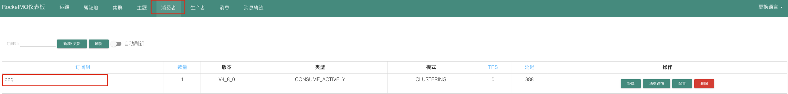

## 代码实现Consumer消费指定Topic中的Message


#### 创建项目，引入依赖

```xml
<!-- https://mvnrepository.com/artifact/org.apache.rocketmq/rocketmq-client -->
<dependency>
  <groupId>org.apache.rocketmq</groupId>
  <artifactId>rocketmq-client</artifactId>
  <version>4.8.0</version>
</dependency>
```

版本最好跟RocketMQ 的Broker Server版本一致


#### 编写代码，消费消息

```java
public class TopicConsumer {

    public static void main(String[] args) throws MQClientException {
        DefaultLitePullConsumer consumer = new DefaultLitePullConsumer("cpg");
        consumer.setNamesrvAddr("10.10.210.24:9876;10.10.210.24:9877");
        consumer.subscribe("t2", "*");//订阅消费的Topic和tag
        consumer.setPullBatchSize(50); //设置一次拉取最多多少条消息，实际拉取可能不到这个数值
        consumer.setPollTimeoutMillis(5000); //拉取超时时间
      	consumer.setMessageModel(MessageModel.CLUSTERING); //使用集群模式
        consumer.start();

        try {
            List<MessageExt> msgs = consumer.poll(5000); //执行一次拉取，超时设置为5秒
            if (CollectionUtils.isEmpty(msgs)){
                System.out.println("没有拉取到消息，休息10S");
            }else{
                msgs.forEach((msg)->{ //打印拉取到的消息
                    System.out.println(msg);
                });
                consumer.commitSync(); //消息消费完成，一定要告诉Broker Server消息已经被消费了，然后Broker server会同步队列的消费位置！
            }
        }catch (Exception e){
            consumer.shutdown();
            e.printStackTrace();
        }

    }

}
```


#### 消费者连接后，可以通过RocketMQ Dashboard中查看消费者的状态

