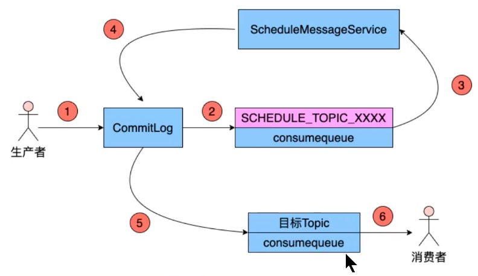

## Message之延时消息与实践


#### 延时消息概念

当消息写入broker后，在指定的时长后才可以被消费处理的消息，称为延时消息


#### 延时消息的用处

采用延时消息可以实现定时任务的功能，而无需使用定时器。**电商中超时未支付的订单要关闭订单！！**

<font color="red">使用场景</font>：在电商平台中，订单创建时会发送一条延迟消息。这条消息将会在30分钟后投递给业务系统（Consumer），后台业务系统收到该消息后会判断对应的订单是否已经完成了支付，如果未完成支付则取消订单。如果已经支付了，则忽略该消息。


#### 延时等级

延时消息的延时时长不支持随意时长的延迟，是通过特定的延迟等级来指定的。延时等级在RocketMQ服务端的MessageStoreConfig类中定义的如下变量中：

```java
private String messageDelayLevel = “1s 5s 10s 30s 1m 2m 3m 4m 5m 6m 7m 8m 9m 10m 20m 30m 1h 2h";
```

如果指定延时等级为3，则表示延时10s，即延时等级是从1开始计数的。


#### 自定义延时等级

需要在系统自带的延时等级外添加 1d 2d 怎么处理？

需要找到所有Broker Server的配置文件，添加如下的配置

```properties
messageDelayLevel = 1s 5s 10s 30s 1m 2m 3m 4m 5m 6m 7m 8m 9m 10m 20m 30m 1h 2h 1d 2d
```


#### 延时消息原理



- Producer将message投递到broker的commitLog服务
- commitLog服务判断message为延迟消息，将实际的topic和queueId保存到message的属性中（为了后面的流程用于消息的重新投递）。并将topic设置成延迟topic（SCHEDULE_TOPIC_XXXX），queueId对应的延时等级 - 1，queueId文件中的所有数据都是按 “消息记录到commitlog时间 + 延时时间” 排序的。消息投递时间保存在tagCode中。
- 消息延迟服务（ScheduleMessageService）从SCHEDULE_TOPIC_XXXX主题循环拉取消息
- 将达到发送要求的消息重新推向commitLog服务
- commitLog服务，将消息推到目标Topic中
- 消费者正常消费消息


#### 生产者如何发送延时消息

```java
@GetMapping("/index")
public void index() throws MQClientException, RemotingException, InterruptedException {


  DefaultMQProducer producer = new DefaultMQProducer("pg");
  producer.setNamesrvAddr("10.10.210.24:9876;10.10.210.24:9877");
  producer.setRetryTimesWhenSendAsyncFailed(3);
  producer.setSendMsgTimeout(5000);
  producer.start();

  byte[] body = ("Hi").getBytes();
  Message message = new Message("t4", "mtYag", body);
  
  message.setDelayTimeLevel(3);//设置消息的延时等级
  
  producer.send(message, new SendCallback() {
    @Override
    public void onSuccess(SendResult sendResult) {

      System.out.println(new SimpleDateFormat("mm:ss").format(new Date()));

      System.out.println(sendResult);
    }

    @Override
    public void onException(Throwable throwable) {
      throwable.printStackTrace();
    }
  });
}

```


#### 消费者如何消费延时消息

跟普通消息一样消费