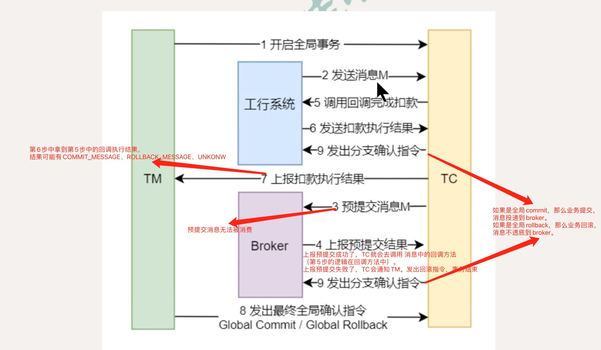
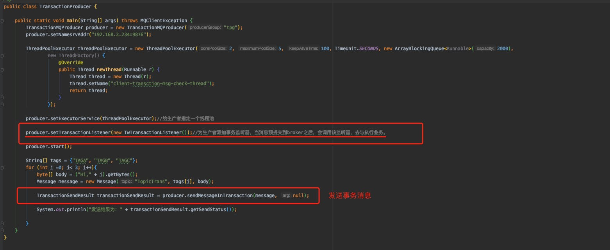
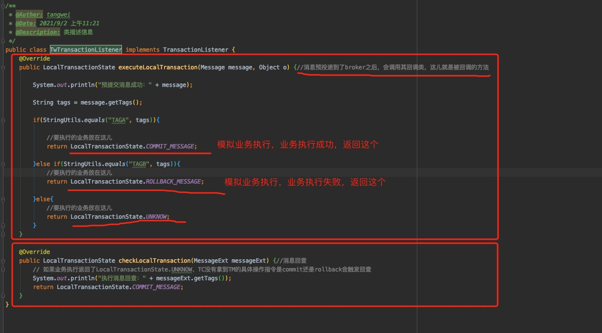

## Message之事务消息与实践

#### 事务消息的概念

事务消息，指的是本地业务执行成功，消息才能成功投递到broker，如果本地业务执行不成功，那么不允许把消息投递到broker的，确保投递出的消息的可靠性。

#### 事务消息整个流程

这张图，是不是跟seata有点像！没错！在RocketMQ中已经集成好了分布式事务的功能！

上图中，必须了解的几个概念：

1. 预提交消息：也称为半事务消息，发送方已经把消息发送到了broker，但是broker未收到最终确认指令，此时该消息被标记成“暂时不能消费”状态，即消费者不能看到该消息。

2. 消息回查：

   - 概念：在我们的业务系统中（上图的工行系统 + TM）与TC之间的消息通讯出现问题就会发生消息回查！

   - 消息回查触发：

     - 第6步把执行结果给TC，TC如果拿到的是UNKNOW状态，那么就要回查第5步的执行结果。
     - 第7步TC向TM发送执行结果，网络原因发送失败了，会触发回查。
     - 第8步TM要向TC返回commit/rollback指令，但是TC一直没有收到TM的指令，也会触发回查。

   - 消息回查配置

     找到所有Broker Server的，添加如下配置

     transactionTimeout = 20 指定TM在20秒内将最终确认状态发送给TC，否则引发消息回查，默认为60S

     transactionCheckMax = 5 指定最多回查次数为5次，超过后将丢弃消息并记录错误日志。默认为15次

     transactionCheckInterval = 10  指定设置多次消息回查的时间间隔为10秒，默认为60S

#### 生产者如何发送事务消息

- 消息预投递，预投递成功之后会立即调用回调类，去预执行业务：

  

- 回调类

  

#### 消费者如何消费事务消息

跟普通消息一样消费 