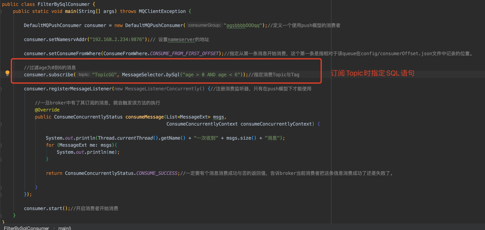

## Consumer消费消息时使用SQL过滤消息

#### 使用SQL过滤的前提

默认情况下Broker Server没有开启消息的SQL过滤功能，需要在Broker加载的配置文件中添加如下配置：enablePropertyFilter = true

push模式的消费者才能用

#### 支持的常量类型及运算符

- 支持的常量类型:

  1. 数值:比如: 123，3.1415

  2. 字符:必须用单引号包裹起来，比如: 'abc'

  3. 布尔: TRUE 或 FALSE

  4. NULL: 特殊的常量，表示空

     

- 支持的运算符有:
  1. 数值比较: >，>=，<，<=，BETWEEN, =
  2. 字符比较: =，<>，IN
  3. 逻辑运算: AND, OR，NOT
  4. NULL判断: IS NULL或者IS NOT NULL

#### 代码实现：

- Producer端

  需要通过SQL过滤的数据写入到消息properties中，放到broker上，消费时可以用条件对数据进行筛选。

  

- Consumer端

  默认情况下broker没有开启消息的SQL过滤功能，需要在Broker加载的配置文件中添加如下配置：enablePropertyFilter = true

  

  