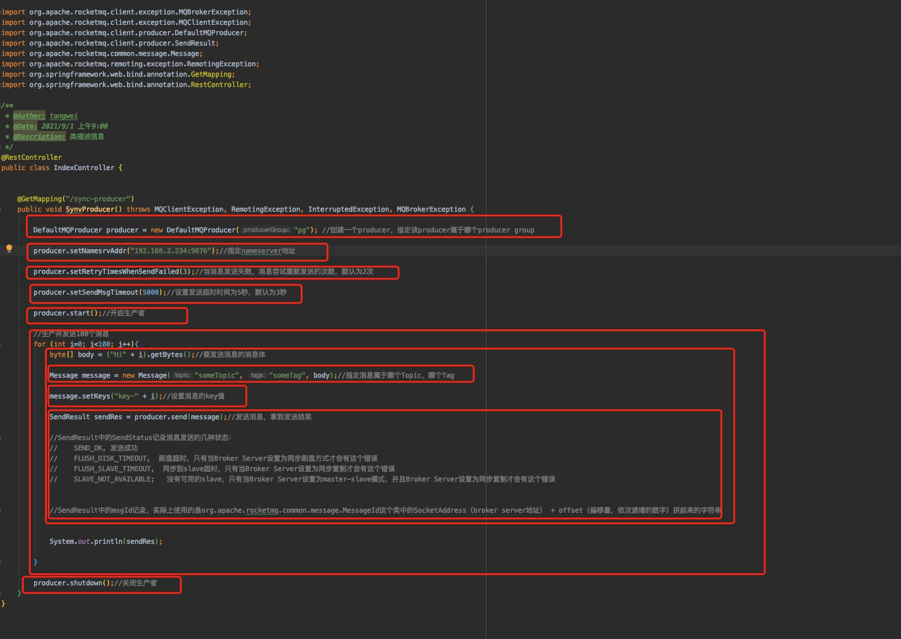

## 代码实现Producer同步方式发送Message


#### 创建项目，引入依赖

```xml
<!-- https://mvnrepository.com/artifact/org.apache.rocketmq/rocketmq-client -->
<dependency>
  <groupId>org.apache.rocketmq</groupId>
  <artifactId>rocketmq-client</artifactId>
  <version>4.8.0</version>
</dependency>
```

版本最好跟RocketMQ 的Broker Server版本一致


#### 编写代码发送消息

