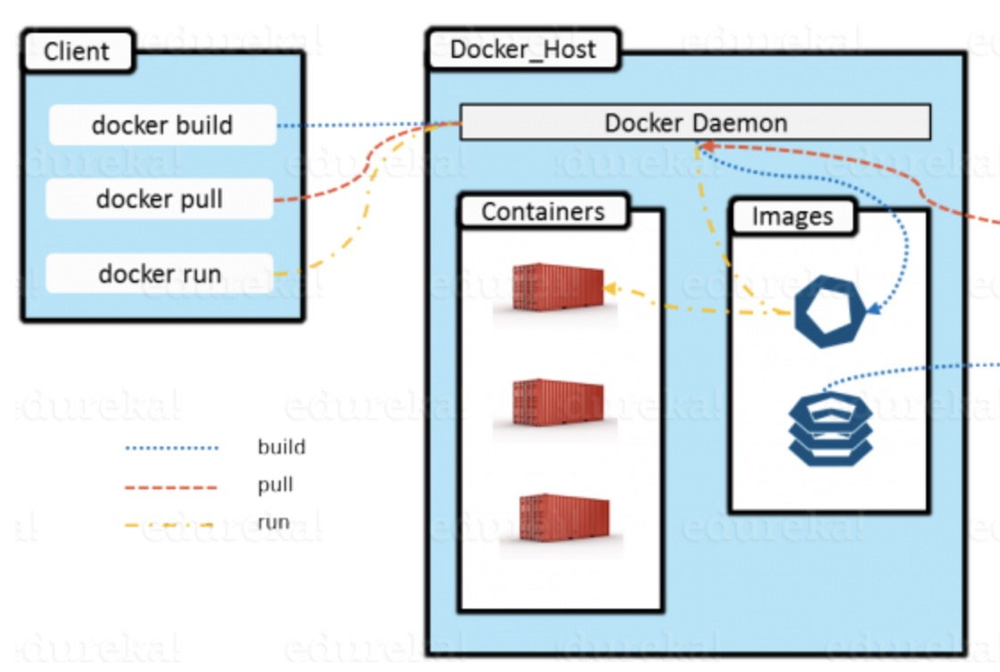

## 再认识docker

经过前面讲的docker的入门和命令解析，我们已经可以玩转docker了！但是，我们还需要再深入了解下docker。

#### 1、思考一个问题！

当我们在命令行输入一个docker version或者docker的其它命令，它返回给我们的数据是从哪里来的呢？

其实，在我们部署docker的时候，docker启动了，后台会启动一个docker daemon的server服务，我们在命令行输入的命令都是在docker的client服务上操作的！

#### 2、客户端与服务端命令工具安装地址

那么docker的client端工具(即docker命令工具)安装在哪里？ /usr/bin/docker

那么docker的server端工具(即dockerd命令工具)安装在哪里？/usr/bin/dockerd

#### 3、客户端与服务端的通讯方式

docker-client端与docker-server端的通讯方式有2种

1. UNIX 域套接字的方式，默认使用这种方式，利用 `/var/run/docker.sock` 提供的一个socket连接，本地client与server进程之间就可以完成通讯。 这种方式局限性就是只能被本地的docker client访问，很安全！
2. 服务端开启端口监听 `dockerd -H IP:PORT` , 客户端通过指定IP和端口访问服务端 `docker -H IP:PORT` 。通过这种方式, 任何人只要知道了你暴露的ip和端口就能随意访问你的docker服务了, 这是一件很危险的事, 因为docker的权限很高, 不法分子可以从这突破取得服务端宿主机的最高权限。